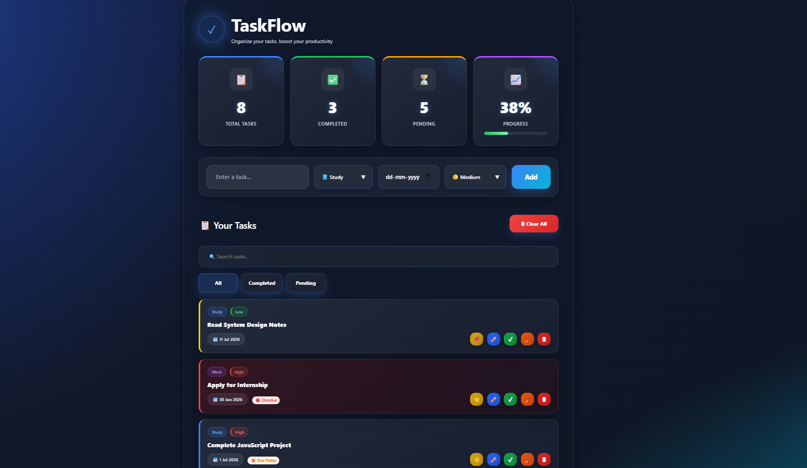
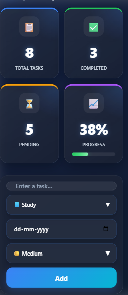
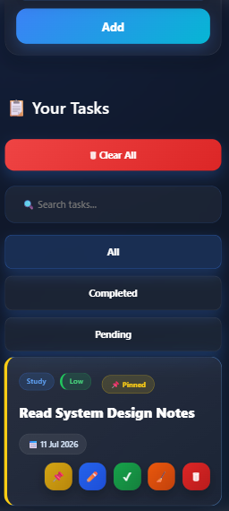

# 🚀 TaskFlow


 
 ---
> **A modern, responsive task management application featuring smart task organization, real-time dashboard analytics, and an intuitive user experience.**

TaskFlow is a sleek and user-friendly task management application designed to help users organize their daily work efficiently. It provides an intuitive interface, real-time task statistics, smart task organization, and a fully responsive experience across desktop and mobile devices.

## 🖥 Desktop Preview



---
## 📱 Mobile Preview

### Home Screen



### Task Management



---
## ✨ Highlights

- 📋 Smart task management
- 📊 Live dashboard with progress tracking
- 📌 Pin important tasks
- 📅 Due date management
- 🔍 Real-time search
- 🎯 Priority & category organization
- 📱 Fully responsive design
- 💾 Local Storage support

---
## 🚀 Features

- ✅ Create, edit, and delete tasks
- 📌 Pin important tasks to the top
- ✅ Mark tasks as completed or pending
- 📅 Assign due dates with automatic status indicators
- 🔴 Detect overdue tasks automatically
- 🔍 Real-time search functionality
- 🎯 Organize tasks by category and priority
- 📊 Live dashboard with task statistics and progress tracking
- 💾 Persistent data using Local Storage
- 📱 Fully responsive design for desktop and mobile devices
### 📋 Feature Summary

| Feature | Status |
|---------|:------:|
| Task Management | ✅ |
| Search | ✅ |
| Filters | ✅ |
| Dashboard | ✅ |
| Responsive Design | ✅ |
| Local Storage | ✅ |
| Due Date Management | ✅ |
| Categories | ✅ |
| Priority System | ✅ |
| Progress Tracking | ✅ |

---
## 🛠️ Tech Stack

| Technology | Purpose |
|------------|---------|
| **HTML5** | Structure of the application |
| **CSS3** | Styling, animations, and responsive design |
| **JavaScript (ES6)** | Application logic and interactivity |
| **Local Storage** | Persistent task storage |
| **Responsive Design** | Optimized experience across desktop and mobile |

---
## 📂 Project Structure

```text
TaskFlow/
│
├── assets/
│   ├── desktop.png
│   ├── mobile-home.png
│   └── mobile-tasks.png
│
├── index.html
├── style.css
├── script.js
├── README.md
└── LICENSE
```

This structure reflects the complete source code and project assets.

## ⚙️ Installation

Follow these steps to run the project locally:

1. Clone the repository:

```bash
git clone https://github.com/YOUR_USERNAME/TaskFlow.git
```

2. Open the project folder.

3. Open `index.html` in any modern web browser (Google Chrome, Microsoft Edge, Firefox, or Safari).

> No additional dependencies or installations are required.
> TaskFlow is built using pure HTML, CSS, and JavaScript.

---

## 🚀 Future Improvements

The following features are planned for future versions of TaskFlow:

- 🌙 Dark / Light theme toggle
- ☁️ Cloud synchronization
- 👤 User authentication
- 🔔 Task reminders and notifications
- 🖱️ Drag & drop task management
- 📊 Advanced productivity analytics
- 📅 Calendar integration
- 📤 Export and import tasks

---
## 👨‍💻 Author

**Shivansh Walia**

Computer Science Student passionate about Frontend Development, UI/UX, and JavaScript.

If you found this project helpful or interesting, consider giving it a ⭐ on GitHub.
---